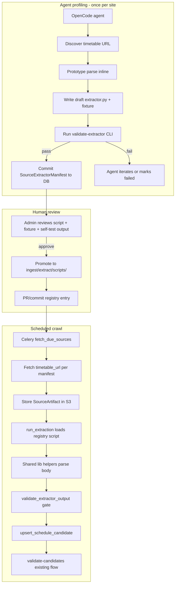
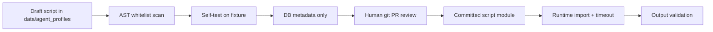

# AI-Generated Per-Source Extractor Scripts

## Problem and pivot

The current Phase 7 approach stores reconnaissance output as [`ExtractionProfile`](src/uk_jamaat_directory/ingest/extract/ai/profile.py) JSON (`css_selector`, `extraction_strategy`, flags). Site layouts vary too much for a small set of declarative strategies to cover the long tail. [`_route_extraction`](src/uk_jamaat_directory/ingest/extract/runner.py) is still a stub, and crawl only fetches the homepage — `timetable_url` from profiles is unused.

**New model:** each profiling agent both finds the timetable **and** authors a site-specific Python parser. Deterministic runs become: **fetch artifact → import approved script → validate output → upsert candidates**. Declarative profile fields become secondary metadata (URL, cadence, audit notes), not the extraction mechanism.



---

## Design principles

| Principle | Decision |
|-----------|----------|
| Separation of fetch vs parse | Scripts **only parse** bytes passed in `ExtractionContext`. Crawl pipeline handles HTTP, robots, backoff, S3. |
| Approved scripts in-repo | Per your choice: human-reviewed modules under [`ingest/extract/scripts/`](src/uk_jamaat_directory/ingest/extract/scripts/) after promotion. Drafts stay in gitignored `data/agent_profiles/`. |
| Standard output contract | All scripts return `list[ExtractedScheduleRow]` ([`types.py`](src/uk_jamaat_directory/ingest/extract/types.py)) — same type `run_extraction` already consumes. |
| Reuse existing schedule logic | Prayer/time normalization via [`schedules/parse.py`](src/uk_jamaat_directory/schedules/parse.py) and [`schedules/prayers.py`](src/uk_jamaat_directory/schedules/prayers.py). Post-extract validation via existing [`validate_candidates`](src/uk_jamaat_directory/schedules/publication.py). |
| AI code is untrusted until reviewed | AST import whitelist + self-test gate before DB commit; git PR review before promotion; runtime timeout on execution. |
| No new public data surfaces | Scripts, fixtures, and draft artifacts remain private operational data. Public API unchanged until candidates are approved and published. |

---

## 1. Extractor contract (ABC + template)

Add [`src/uk_jamaat_directory/ingest/extract/base.py`](src/uk_jamaat_directory/ingest/extract/base.py):

```python
@dataclass(frozen=True)
class ExtractionContext:
    body: bytes
    content_type: str | None
    fetched_url: str
    source_id: uuid.UUID
    mosque_timezone: str  # default Europe/London
    artifact_id: uuid.UUID
    # optional: secondary artifacts keyed by role ("pdf", "image")

class MosqueExtractor(ABC):
    """Every approved per-source script implements this."""

    @classmethod
    @abstractmethod
    def source_external_id(cls) -> str: ...

    @classmethod
    @abstractmethod
    def timetable_url(cls) -> str: ...

    @classmethod
    @abstractmethod
    def fetch_cadence(cls) -> FetchCadence: ...  # daily | weekly | monthly

    @abstractmethod
    def extract(self, ctx: ExtractionContext) -> list[ExtractedScheduleRow]: ...
```

Add [`src/uk_jamaat_directory/ingest/extract/scripts/_template.py`](src/uk_jamaat_directory/ingest/extract/scripts/_template.py) — the canonical file agents copy. Include commented examples for HTML table, PDF (via lib), and OCR path.

**`FetchCadence` enum** maps to hours for crawl scheduling:

| Cadence | Default hours | Typical use |
|---------|---------------|-------------|
| `daily` | 24 | HTML pages updated frequently |
| `weekly` | 168 | Monthly PDF replaced weekly |
| `monthly` | 720 | Static monthly timetable PDFs |
| `on_change` | 24 fetch + hash skip | Same as daily fetch; extraction skipped when artifact hash unchanged |

---

## 2. Shared helper library

New package [`src/uk_jamaat_directory/ingest/extract/lib/`](src/uk_jamaat_directory/ingest/extract/lib/):

| Module | Responsibility | Notes |
|--------|----------------|-------|
| `html.py` | BeautifulSoup/lxml table/list parsing, CSS helpers, text cleanup | Primary path for `html_table` / `html_list` |
| `pdf.py` | pdfplumber page→text/table extraction | Wrap dependency; lazy import |
| `ocr.py` | Image/PDF raster → text via tesseract | Single `ocr_bytes()` entry point |
| `time.py` | Re-export `parse_hhmm`; add `parse_flexible_time` for `6:30pm`, `18.30` | Delegates to existing [`schedules/parse.py`](src/uk_jamaat_directory/schedules/parse.py) where possible |
| `prayer.py` | Re-export `parse_prayer`, `PRAYER_ALIASES` | Single source of truth |
| `dates.py` | `parse_uk_date`, `infer_date_range`, `dates_for_week` | Handles "Mon 3 Jun" style labels |
| `rows.py` | `build_row(...)`, `rows_for_date(...)` builders returning `ExtractedScheduleRow` | Reduces boilerplate in scripts |

**Import policy for agent scripts:** only `uk_jamaat_directory.ingest.extract.lib.*`, `uk_jamaat_directory.ingest.extract.base`, `uk_jamaat_directory.ingest.extract.types`, `uk_jamaat_directory.domain`, stdlib (`re`, `datetime`, `dataclasses`, `typing`, `decimal`). Enforced by AST scanner in validator (below). No `requests`, `urllib`, `subprocess`, `os.system`, `open` (scripts receive bytes, not filesystem paths).

Add optional deps to `pyproject.toml` behind extras: `pdfplumber`, `pytesseract`, `Pillow` — used by lib, not imported directly by scripts.

---

## 3. Validation gate (agent success + CI + runtime)

Add [`src/uk_jamaat_directory/ingest/extract/validate.py`](src/uk_jamaat_directory/ingest/extract/validate.py) with `validate_extractor_module(path, *, fixture_path) -> ExtractorValidationResult`:

**Gate A — static (before any execution):**
- File parses as valid Python
- Defines exactly one `MosqueExtractor` subclass
- AST scan: no forbidden imports/calls
- Required classmethods present (`source_external_id`, `timetable_url`, `fetch_cadence`)
- `source_external_id` matches the source being profiled

**Gate B — self-test (agent iteration loop):**
- Load fixture HTML/PDF from `data/agent_profiles/<run>/<source_id>/fixture.bin` (saved by agent during profiling)
- Instantiate extractor, call `extract(ExtractionContext(...))`
- Run `validate_extractor_output(rows)`:
  - Non-empty row list
  - Each row has valid `Prayer`, `HH:MM` times, `timezone`, `session_number >= 1`
  - Coverage: at least one row for **today** (mosque TZ) and at least 5 of 7 days in next week (configurable thresholds)
  - Expected prayers for each date via [`expected_prayers_for_date`](src/uk_jamaat_directory/schedules/prayers.py) — warnings if missing, errors if zero rows for a date with timetable
  - No duplicate `(date, prayer, session_number)`
- Run existing `validate_candidate` rules in dry-run mode on converted rows (jamaat ordering, DST warnings)

**Gate C — runtime (every `run_extraction` call):**
- Re-run Gate B output checks (fast, no AST)
- On failure: mark `ExtractionRun` failed, increment `SourceHealth.consecutive_failures`, do not upsert candidates

**Agent success criteria** (replaces current `profile_status=ready` heuristics):
- `found=true` AND Gate A + B pass AND agent writes manifest JSON
- Otherwise `profile_status=script_failed` or `review_needed`

New CLI: `validate-extractor --source-id <uuid> [--fixture path]` — used by agent (bash in prompt), operators, and CI.

---

## 4. Schema and metadata changes

### Replace `ExtractionProfile` v1 focus

Introduce [`SourceExtractorManifest`](src/uk_jamaat_directory/ingest/extract/manifest.py) (Pydantic v2):

```python
class SourceExtractorManifest(BaseModel):
    manifest_version: str = "2.0"
    timetable_url: str
    fetch_cadence: FetchCadence
    asset_type: Literal["html_table", "html_list", "pdf", "image", ...]
    requires_javascript: bool = False
    requires_ocr: bool = False
    script_module: str | None = None      # set after promotion, e.g. scripts.mosque_abc123
    script_class: str | None = None       # e.g. AbcMosqueExtractor
    fixture_content_hash: str | None = None
    self_test: SelfTestResult | None = None
    found: bool
    confidence: float
    review_notes: str
    urls_explored: list[str]
    navigation_log: str
```

Stored in `mosque_sources.metadata_["extractor_manifest"]`. Retire `extraction_profile` as primary field; keep reading v1 profiles during migration with a deprecation warning.

### Profile status workflow (revised)

| Status | Meaning |
|--------|---------|
| `pending` | No agent run yet |
| `script_draft` | Agent produced draft script + passed self-test; awaiting human promotion |
| `script_failed` | Agent could not produce passing script |
| `approved` | Script committed in-repo; eligible for scheduled extraction |
| `retired` | Script broken/disabled; needs re-profile |

Add explicit `extractor_approved_at` and `extractor_approved_by` in metadata (admin action).

### Registry file

[`src/uk_jamaat_directory/ingest/extract/scripts/registry.json`](src/uk_jamaat_directory/ingest/extract/scripts/registry.json):

```json
{
  "abc-mosque-slug": {
    "module": "uk_jamaat_directory.ingest.extract.scripts.abc_mosque_slug",
    "class": "AbcMosqueExtractor",
    "source_external_id": "abc-mosque-slug"
  }
}
```

Updated by `approve-extractor` CLI. `run_extraction` resolves `source.external_id` → registry → dynamic import.

**Naming convention:** one file per source: `scripts/{sanitized_external_id}.py`, class name `{PascalCase}Extractor`.

---

## 5. Agent workflow changes (Phase 7 v2)

Update [`agent_prompt.py`](src/uk_jamaat_directory/ingest/extract/ai/agent_prompt.py) and [`agent_orchestrator.py`](src/uk_jamaat_directory/ingest/extract/ai/agent_orchestrator.py):

**Expanded agent task (same OpenCode subprocess model per ADR 0015):**
1. Navigate site (existing constraints: domain jail, 10-page budget)
2. Identify timetable URL and asset type
3. Copy `_template.py` → `data/agent_profiles/<run>/<source_id>/extractor.py`
4. Implement `extract()` using only allowed imports; save sample bytes as `fixture.bin`
5. Run `validate-extractor --source-id <id> --fixture fixture.bin` via bash
6. Iterate until pass or budget exhausted
7. Write `manifest.json` (SourceExtractorManifest without `script_module` yet)
8. Write legacy-compatible `result.json` for backward compat during transition

**Orchestrator `_commit_profile` changes:**
- Persist `extractor_manifest` + draft script path in `ExtractionRun.metadata_`
- Set `profile_status = script_draft` when self-test passes; `script_failed` otherwise
- Store `fixture_content_hash` for promotion verification

**Promotion CLI** `approve-extractor --source-id <uuid>`:
1. Verify draft script still passes validator against stored fixture
2. Copy `extractor.py` → `src/.../scripts/{external_id}.py`
3. Add synthetic fixture to `tests/fixtures/extractors/{external_id}.html` (hand-redacted/synthetic — never commit raw mosque HTML from production)
4. Update `registry.json`
5. Set metadata `profile_status=approved`, `script_module`, `script_class`
6. Operator commits via git (agent does not auto-commit)

---

## 6. Deterministic extraction integration

Update [`runner.py`](src/uk_jamaat_directory/ingest/extract/runner.py) `_route_extraction`:

```python
def _route_extraction(*, body, content_type, source, artifact) -> ExtractResult:
    if source.source_type != SourceType.MOSQUE_WEBSITE:
        return ExtractResult(warnings=["no extractor for source_type=..."])
    manifest = source.metadata_.get("extractor_manifest")
    if not manifest or source.metadata_.get("profile_status") != "approved":
        return ExtractResult(warnings=["no approved extractor"])
    extractor_cls = load_from_registry(source.external_id)
    ctx = ExtractionContext(body=body, content_type=content_type, ...)
    rows = extractor_cls().extract(ctx)
    validation = validate_extractor_output(rows)
    if not validation.ok:
        return ExtractResult(warnings=validation.errors)
    return ExtractResult(rows=rows, extractor_version=extractor_cls.__name__)
```

Add `load_from_registry` with module cache and clear error messages for missing/broken scripts.

---

## 7. Crawl pipeline integration

Update [`pipeline.py`](src/uk_jamaat_directory/ingest/crawl/pipeline.py):

**Fetch URL:** use `extractor_manifest.timetable_url` when `profile_status == approved`, else fall back to `source.source_url` (homepage only during profiling/draft).

**Per-source cadence:** replace global `crawl_interval_hours` with manifest `fetch_cadence` in `_schedule_next_fetch`:

```python
CADENCE_HOURS = {"daily": 24, "weekly": 168, "monthly": 720, "on_change": 24}
hours = CADENCE_HOURS.get(manifest.fetch_cadence, settings.crawl_interval_hours)
```

**Multi-asset fetch (phase 2 within this work):** if `requires_javascript`, flag source for Playwright fetch path (new `ingest/fetch/playwright.py`, gated by config). If asset is PDF/image, fetch that URL directly with correct `content_type` for S3 key extension.

**Hash skip for `on_change`:** when artifact content hash matches previous successful extraction, skip `run_extraction` (already partially supported via `_latest_successful_extraction_for_artifact`).

---

## 8. Admin API extensions

Extend [`api/v1/admin.py`](src/uk_jamaat_directory/api/v1/admin.py):

| Endpoint | Purpose |
|----------|---------|
| `GET /sources/{id}/extractor` | Manifest, status, self-test summary, script path if approved |
| `POST /sources/{id}/extractor/approve` | Triggers promotion workflow (or returns instructions for git commit in MVP) |
| `POST /sources/{id}/profile` | Existing — now runs v2 agent (script + manifest) |
| `GET /sources/{id}/profile` | Surface manifest fields + `profile_status` |

Fix existing gaps: return `profiled_at`, link latest `extraction_run_id`.

---

## 9. Security model



- **Draft phase:** AST gate prevents obviously dangerous code; agent runs in existing OpenCode sandbox
- **Promotion:** human reads script in PR (~50–150 lines expected per site)
- **Runtime:** `importlib` with 30s execution timeout (signal/alarm or `asyncio.wait_for` in thread pool); no network from script context
- **Dependency surface:** scripts cannot add pip deps; all heavy lifting through versioned `lib/`

---

## 10. Testing strategy

| Layer | Tests |
|-------|-------|
| `lib/` | Unit tests for HTML table, time formats, prayer aliases, date inference |
| `validate.py` | Forbidden import detection; coverage rules; fixture-based pass/fail |
| `runner.py` | Integration: synthetic registry entry + fixture artifact → candidates in PostGIS test |
| `scripts/` | CI runs `validate-extractor` on every committed script against its `tests/fixtures/extractors/` counterpart |
| Agent | No CI agent runs; manual `profile-agent-sources --limit 1` smoke |

Add `make validate-extractors` target running validator across all registry entries.

---

## 11. Migration from v1 profiles

1. Keep reading `metadata.extraction_profile` if `extractor_manifest` absent (log warning)
2. Sources with v1 `profile_status=ready` but no script → re-queue for v2 agent (`--force`)
3. Bump `profile_version` to `2.0` in manifest
4. Update ADR 0015 (amend scope: profile + script authorship) and add **ADR 0016: Per-source extractor scripts**
5. Update [`AGENTS.md`](AGENTS.md) current scope bullet for Phase 7/8

---

## 12. Observability and failure handling

- `ExtractionRun.metadata_`: `script_class`, `self_test_summary`, `validation_errors`, `fixture_hash`
- Re-profile triggers (manual MVP, automated later): `consecutive_failures >= 3` AND `profile_status=approved` → set `retired`, notify admin
- Admin reporting: count by `profile_status`, scripts in repo, extraction success rate per script
- Freshness dashboard: add `profile_missing` / `script_not_approved` buckets (already planned in pipeline plan)

---

## 13. Implementation order

Recommended vertical slices:

1. **Foundation** — `base.py`, `lib/` (html + time + prayer + rows), `validate.py`, `_template.py`, `make validate-extractors`
2. **Golden path** — hand-write one reference extractor + synthetic fixture (prove runner → candidates flow end-to-end)
3. **Runner + registry** — wire `_route_extraction`, `registry.json`, `load_from_registry`
4. **Crawl cadence + timetable URL** — fetch correct URL, per-source `next_fetch_at`
5. **Agent v2** — prompt, orchestrator, manifest commit, draft artifact storage
6. **Promotion CLI** — `approve-extractor`, fixture promotion to tests/
7. **Admin API** — extractor endpoints, status workflow
8. **PDF/OCR lib modules** — after HTML path proven
9. **Playwright fetch** — sources with `requires_javascript` (can defer if flagged `review_needed`)
10. **ADR + docs + bulk re-profile** — migrate existing v1 profiles

---

## 14. Risks and mitigations

| Risk | Mitigation |
|------|------------|
| ~1000 Python files in repo | Flat `scripts/` dir + registry; consistent naming; CI validates all; consider subdirs by region if needed later |
| AI scripts break on site redesign | `on_change` cadence + hash monitoring + consecutive-failure retirement + re-profile |
| Script execution security | AST whitelist + PR review + no network + timeout; never execute draft scripts in production |
| Licensing of fixtures | Only synthetic/redacted fixtures in `tests/`; production fixtures stay in gitignored `data/` |
| JS-rendered sites | Explicit `requires_javascript` flag; defer to Playwright fetch helper; agent documents limitation |
| Operator bottleneck on PR review | Batch approve CLI; start with high-confidence self-tests; template keeps scripts small |

---

## 15. Out of scope (unchanged)

- Public frontend for profile review (Phase 10 admin UI consumes new APIs)
- Auto-publishing website-derived candidates (still manual approve per ADR 0007)
- Charity/Google as redistributable sources
- LLM-based row extraction at runtime (scripts are fully deterministic)
